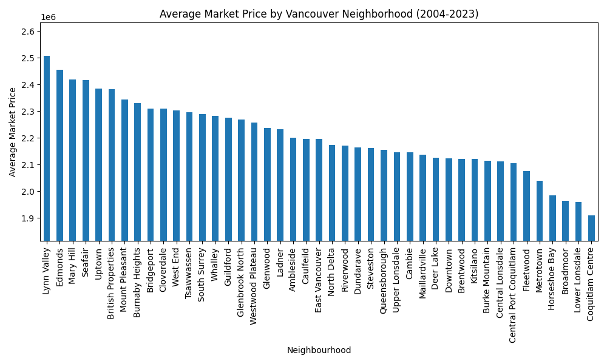
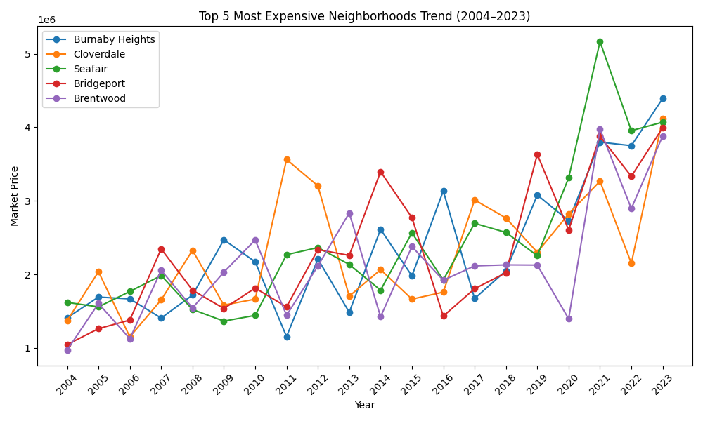
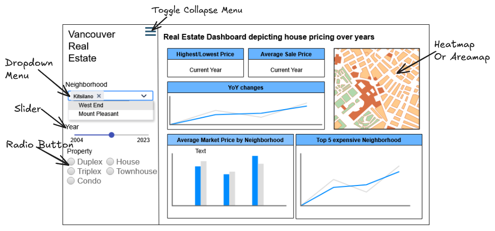

# Vancouver Housing Dashboard Proposal

## Section 1: Motivation and Purpose

**Target Audience:**
Our primary audience includes real estate investors, home buyers, and housing market analysts interested in Vancouver’s property trends. The dashboard will also serve city planners or policy makers who want to monitor market shifts over the past two decades. In this project, we embody the role of a data consultant, providing actionable insights to inform investment or policy decisions.

**Problem:**
Vancouver’s housing market has experienced significant fluctuations over the past 20 years. Potential buyers and investors often struggle to answer questions such as:
- Which neighborhoods are appreciating fastest?
- How have market prices evolved over time by property type?
- Where are the most affordable investment opportunities relative to the market average?
Currently, the data is raw, dispersed across multiple sources, and difficult to analyze quickly without technical knowledge. Users need a centralized, interactive tool to explore trends and make informed decisions efficiently.

**Solution:**
The proposed dashboard will provide interactive visualizations of Vancouver housing data, allowing users to:
- Explore trends by year, neighborhood, and property type.
- Compare historical and current market prices.
- Filter and drill down to find actionable insights for investments or policy decisions.
The dashboard transforms complex datasets into a user-friendly, visual interface, bridging the gap between raw data and actionable decisions.

## Section 2: Description of the Data

We will use the “Vancouver House Prices for Past 20 Years” dataset from [Kaggle](https://www.kaggle.com/datasets/jennyzzhu/vancouver-house-prices-for-past-20-years)

**Dataset Overview:**
Rows: ~3521 entries
Columns: 14 features, including Year, Neighborhood, Property Type, Market Price, Bedrooms, Bathrooms, Square Footage, Garage, Basements.

**Relevance:**
- Neighborhood and Property Type allow users to analyze geographic and categorical trends.
- Year and Market Price enable temporal analysis of housing appreciation or decline.
- Bedrooms, Bathrooms, and Square Footage support comparisons across property sizes, helping users identify the most cost-effective options.
- Garage, Basements and additional features can provide insight into investment potential or housing density patterns.
This dataset is rich enough to support both aggregate trend analysis (market-wide) and granular comparisons (neighborhood or property-type specific).

## Section 3: Research Questions & Usage Scenarios

**Persona:**
Name: Leslie Rodgers
Role: Real estate investor and part-time analyst
Goal: Identify top-performing neighborhoods for investment in Vancouver over the past 5 years

**Usage Scenario:**
Leslie wants to make an informed decision about purchasing a property in Vancouver. She logs into the dashboard, filters for properties by type and neighborhood, and compares price trends over the last 10 years. By visualizing historical trends, Leslie identifies neighborhoods with strong appreciation potential while avoiding overpriced areas.

**User Stories:**

As an investor, I want to compare average market prices across neighborhoods so that I can identify high-growth investment areas.

As a buyer, I want to filter by property type and size so that I can focus on homes that fit my budget and requirements.

As a policy analyst, I want to visualize trends over time so that I can report on housing affordability and inform policy decisions.

## Section 4: Exploratory Data Analysis

**Selected User Story:**

As an investor, I want to compare average market prices across neighborhoods so that I can identify high-growth investment areas.

Analysis:
**Visualization 1:** Bar chart chart of average market price per neighborhood over the past 20 years.

**Visualization 2:** Line chart showing top 5 most expensive neighborhoods over the past 20 years.

These visualizations help users quickly identify which neighborhoods have historically appreciated, allowing investors to prioritize their focus. For example, the bar chart highlights growth trends, while the line chart pinpoints current high-value areas.

The full exploratory analysis and code used to generate these visualizations are available in: `notebooks/eda_analysis.ipynb`

## Section 5: App Sketch & Description

Sketch:

Note: This mockup shows a landing page with an interactive map, filters, summary stats, and charts.

**Description of Components:**
- **Interactive Map:** Displays property locations with color-coded market prices.
- **Year Filter:** Slider to select specific years or ranges.
- **Neighborhood Filter:** Multi-select dropdown to focus on specific areas.
- **Property Type Filter:** Radio button to filter by type (house, condo, townhouse).
- **Summary Stats:** Panels showing average price, highest/lowest price, and growth rate.
- **Average Market price Bar Chart:** Historical price trends per neighborhood.
- **Top Neighborhoods Line Chart:** Top 5 neighborhoods trend by market price.

Interactions:
Users can combine filters to narrow down results.
Hovering over charts or map points provides tooltips with key metrics.
Charts and summary stats update dynamically based on filters to support rapid decision-making.

This design provides a comprehensive, interactive dashboard with 8 components, ensuring that users can answer all key questions efficiently, from identifying high-growth areas to analyzing affordability.